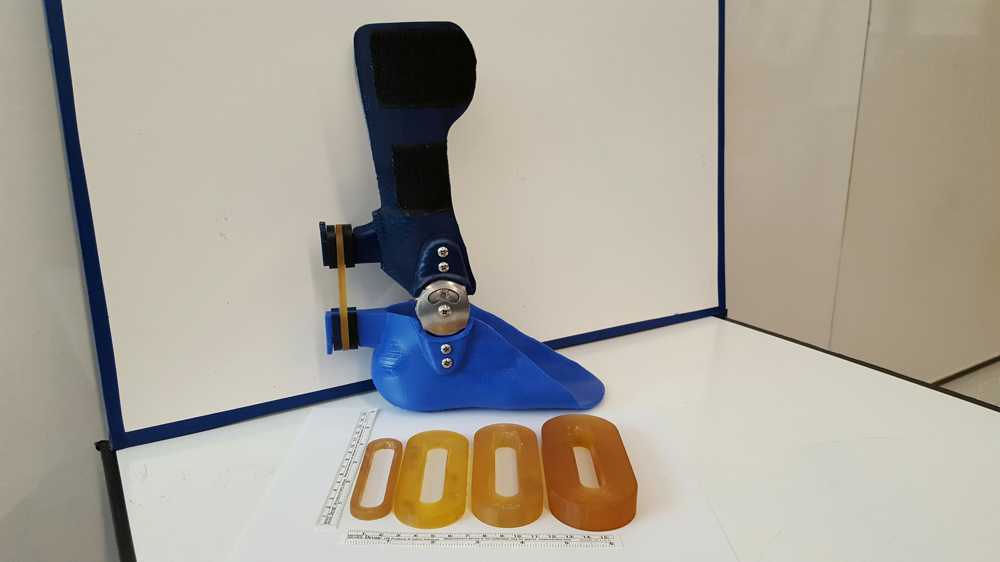
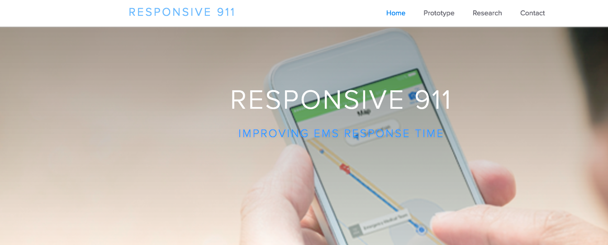
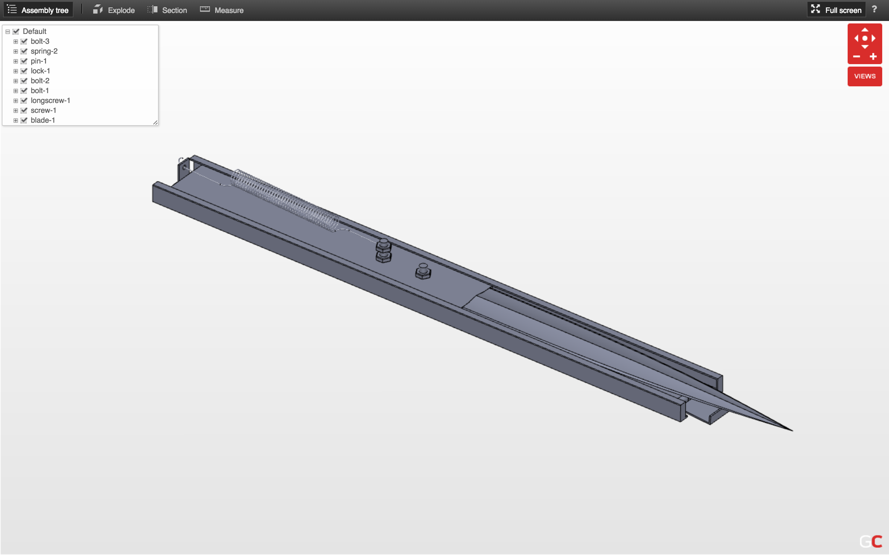

[Resume](https://www.dropbox.com/s/epynqyth4lju63r/Eric_Eckert%20resume%20June%2014%2C%202016.pdf?dl=0) | [LinkedIn](https://www.linkedin.com/in/ericsueckert) | [GitHub](https://github.com/ericsueckert)

School email: eric95@uw.edu

Personal email: ericsueckert@gmail.com


Hi, welcome to my portfolio.

My name is Eric Eckert. I am a third year student at the University of Washington in Seattle. I have interests in a wide variety of subjects. My main skills lie in computer programming, and my love for physics also led me to take classes in mechanical engineering. My current career aspirations lie in data science.

A current version of my resume is available [here](https://www.dropbox.com/s/epynqyth4lju63r/Eric_Eckert%20resume%20June%2014%2C%202016.pdf?dl=0).


----

### Experience

#### Microsoft
Intern | Bing Search | Beijing, PRC | June 2016 -- September 2016

##### Tweet Clustering
I Worked on social trending news detection for the news vertical of the Bing search engine. Developed a new multi level clustering algorithm from scratch to identify trending news worthy stories in Twitter data with less latency. Leveraged and modified various document similarity statistics among other Tweet data to process, filter, then cluster Tweets after querying, which were then used for secondary clustering. Successfully aggregated results with under 1000 news-worthy clusters, some with 10,000 or more Tweets.

##### Spam User Detection
Aided in research and optimization of Twitter user spam detection by training a machine learning model for classification, and analyzing the results. Leveraged SVM machine learning model using libSVM. Analyzed false positives of results and further improved accuracy by expanding training set. Version 1 had an initial F1 score of 96%.

_References available upon request._


-----

### Programming projects
You can find a summary of my github account [here](githubReport.html). It contains most of the projects I have done both in class and independantly. I've had experience programming in various contexts. [Here](https://github.com/ericsueckert) is the link to my actual Github profile.

```{r, echo=FALSE, message=FALSE, warning=FALSE}
library(jsonlite)
library(plotly)
library(dplyr)
source("scripts/github-api.R")

repo_df <- getUserInfo("ericsueckert")

# A bar plot showing number of repositories per language
summary_data <- repo_df %>% group_by(language) %>%
  summarise(
    total_repos = n()
  )
plot_ly(summary_data, x = language, y = total_repos,
        type = 'bar',
        color = total_repos
        ) %>%
  layout(xaxis = list(title = "Language"), yaxis = list(title = "Number of Repositories"))

```


---

#### Flight Book
One of the later projects in my Database Management class. This was the first instance of creating a real application that uses SQL to communicate with a database. 

From earlier in the quarter I had ingested some data of flights in 2015 (about 1 million lines) into Microsoft Azure. Additionally, I added tables to represent users of the application, as well as what flights they had "reserved". Then, provided with a program skeleton, I wrote a Java application that would connect to this database. The user would be able to search for flights with multiple parameters for origin, destination, date, direct flight or transfer, and number of results. In order to book a flight, the user has to log in. The program will check the username and password against the user table in the database. If loggd in, the user may perform other actions. If a search had been made, the user may specify which itinerary to book, and if there are no date conflicts, may book that itinerary. The user may also view his reservations, and cancel them. All queries were submitted using prepared statements to prevent code injection. Transactions were used wherever necessary to ensure no errors occured during any processes.

You can view the repository [here](https://github.com/ericsueckert/flight-book).

---

#### Text Associator
First major project in my Data Structures and Algorithms class. This was my first significant implementation of a hash table. The table stores data from a thesaurus, which contains words from the english language. Each word has a list of words that are related, or associated, with that word. 

In this project I wrote a class that would store this data, and methods that would alter it. This was accomplished by hashing each word with the built in hash function and storing it in the table. The value mapped to each has would be a set of all the words associated with the hashed word. The class contains elements to add and remove words, as well as add and remove word associations. The size of the table will change dynamically based on load factor. I used separate chaining in order to prevent collision. The purpose of this implementation was to have a runtime of O(1).

You can view the repository [here](https://github.com/ericsueckert/text-associator).

---

#### College Admissions Data Visualization
The final project my group did for the class Info 498F. We were allowed full freedom on what to build. The only guidelines were: The project had to take a rich data set and present the data in a matter that would provide insight and perspective using the skills we learned throughout the course.

When I was a junior and senior in high school, I remembered how lost I felt during the college admission process. There are thousands of colleges in the United States alone, and a student needs to eventually decide on one. The data set we decided on was data on college admission statistics from colleges across the United States. We decided to use this data to provide insight for prospective college students so they may have a better grasp of which schools they would want to target. 

The application was built using the Shiny platform, which was designed exclusively for web applications written in R. Other resources we used include the library "dplyr", which contains many functions to make data wrangling simpler and more robust, and "plotly", which is a library that allows for easy generation of streamlined, rich, and aesthetic plots. Because there were 4 group members, this project was good practice in using source control with multiple contributors, especially resolving conflicts.

The application itself may be viewed [here](https://ericsueckert.shinyapps.io/college_admissions_app/). It may take a minute or two to load in order to activate the application if no one has visited it recently.

The repository may be viewed [here](https://github.com/ericsueckert/Final-Project-X).

Although the project was turned in earlier this year, I may have plans to continue working on it. As such, you may find minor bugs in the application. Please let me know if you notice something!


---

#### Text Based Game
Summer of 2014, I had just finished my first year of undergraduate study, and my friend Thomas and I had nothing to do. Thomas came up with the idea to make a text based game, a simple type of game that has a player influenced storyline. A typical text game consists of many scenarios with a text description of what currently happened, then lists a few choices for what to do next that the player may choose from. Once the player makes a choice, the story progresses. 

We programmed a basic application in Java to implement this sort of game based on a decision tree. In addition to the most basic feature of choosing story direction, we added items that the player can pick up, drop, or use as "keys" for certain story choices. We also added checkpoint resets in case the player was not satisfied with the choices he made and wanted to start over. The game was programmed with a simple GUI that had the appropriate buttons and fields for file loading and gameplay.

The game data was stored in a text file, and read into the tree using recursion. At this time I had not learned about any other ways of storing data. In retrospect, it probably would have been far easier to store game data in Json or XML format, which might also have negated the need for using recursion to read in the data.


You can view the repository for this application [here](https://github.com/ericsueckert/Text-based-game).


---

### Info 498F
Winter 2015 I took the experimental class Info 498F, "Technical Foundations". I picked up many useful skills in the class, including how to properly use source control (GitHub) individually and in a team setting. I also learned how to write in R, more specifically data wranglign and visualization, and utilizing certain web service APIs. This portfolio page was made using the skills I learned. Here are some of the projects I made in this class:


[Github Report](githubReport.html):
This page was linked at the top of my portfolio as well. It uses GitHub's web service API to query data on a user, in this case me, and displays certain data. On this page you may see various statistics regarding my repositories.

[Iris Flowers](https://ericsueckert.shinyapps.io/a8-building-applications/):
A basic Shiny web application that uses a data set of three species of Iris and their Sepal and Petal dimensions, and displays two dimesions in a graph. Simple widgets allow for changing of species, dimensions, and color.

[Shooting Map](mappingshooting.html):
An R markdown page that provides insight into shooting statistics in the United States using a data set of all US shootings in 2015. Includes an aggregate summary of all incidents, summary of incidents by state, an interactive map plot of all shootings, and an interactive graph of all shootings.

[Info 498 Students](info498.html):
An R markdown page that provides simple statistics on the students enrolled in the Info 498F class. Although very straightforward, this was the first group project, and practice in using source control with multiple contributors (int this case four). 


---

### Research

#### Ankle Foot Orthoses



I am very passionate about my research. I work in the [UW Steele Ability Lab](http://depts.washington.edu/uwsteele/) that researches orthotics. The project I work on specifically is optimizing ankle foot orthoses, or AFOs. I began my research in fall of 2015, and am still a part of the lab. This project means a lot to me, because around the time when I started, I began to doubt my ability to succeed in the traditional academic system, but this research was able to give me purpose in the hopes that one day I may change someone's life.

Ankle foot orthoses (or AFO for short) are commonly perscribed to individuals with impairment of the lower leg. AFOs aid in gait by inducing a moment on the ankle joint, reducing the need for biological ankle moment output by combining it with the mechanical ankle moment ouput of the AFO. For impaired individuals who are not able to produce full standard biological ankle moment output, the ankle moment of the AFO will supplement the biological ankle moment so that the total ankle moment will be on par with that of an unimpaired individual. AFOs have also been shown to reduce metabolic cost in unimpaired individuals.

The current standard of AFO consists of a single piece of plastic that the patient may wear. The fabrication process is both lengthy and expensive. Additionally if adjustments are desired, the AFO must be completely refabricated. Alternatively, a variable stiffness AFO would allow for adjustments of the mechanical moment of the AFO if needed. The purpose of our project is to manufacture effective variable stiffness AFOs using 3D printing technology.

Through classes and my time at the lab, I also learned how to program in MatLab. One example of my work is a script I wrote that takes kinematic data of the ankle joint, and draws a plot of ankle moment over a single gait cycle in addition to the mechanical moment induced by various polymer bands over gait cycle. You can view the repository for this script [here](https://github.com/ericsueckert/plot_ankle_moment).

June 3, 2016 I attended my first conference, the [NorthWestern Biomechanics Symposium](http://www.nwbs.mech.ubc.ca/), which this year was held in Vancouver, BC in Canada. You can read the abstract [here](https://www.dropbox.com/home?preview=NWBS+2016+Abstract.pdf).


#### Disability Stakeholder Research

This year in 2017 I am working with post-doctorate [Heather Feldner](https://depts.washington.edu/uwsteele/team_member/heather-feldner/) in analyzing stakeholder perceptions of human ability and disability. By holding interviews and focus groups with stakeholders, we can record their responses and conduct a qualitative analysis of the transcript. I will be approaching the issue from a more qualitative angle by writing an algorithm that will aggregate the diction in the transcript, which may provide more insight into stakeholder feedback.

If you are interested in learning more about the laboratory I work in, you can access the website [here](http://depts.washington.edu/uwsteele/). The project that I work on can be found as "Optimizing Orthoses" under the "Projects" tab. Here you can read a short summary of our project research, as well as view notable news regarding our project and team members. Official major publications by lab members may be found under the "Publications" tab.

---

### Design

[](http://responsive911.webflow.io/)

Autumn 2016 was my first quarter in the Human Centered Design and Engineering major, and it proved to be very fruitful with my first prototyping project, which you will find [here](http://responsive911.webflow.io/).

---

### CAD
[](https://grabcad.com/library/assassin-s-creed-hidden-blade-5)

In my second year of undergraduate study, I took a class in introductory AutoCad drawing. My final project is a simple model of a hidden blade inspired by the video game Assassin's Creed. The assembly contains 11 unique parts, and is fully defined. When the spring is removed, the appropriate constraints are in place so that parts may be moved. Also included is an exploded view drawing.

You can view the design [here](https://grabcad.com/library/assassin-s-creed-hidden-blade-5).

---

### Film, Video, Animation

Since my Freshman year of high school, one of my lesser interests has been in filmmaking. Although I have had some minor formal training, I have very few concrete works to show since I had mostly made videos for fun. Between Senior year of high school and my first year of undergraduate study, I also briefly got into kinetic typography. My Vimeo account, where I submit my more legitimate work, can be found [here] (https://vimeo.com/luciferthesecond). 


#### LEO Club Mixer: A Trip Down Memory Lane
##### Producing & writing: Kevin Higashihara
##### Directing & camera: Ted Leung
##### Editing & animation: Eric Eckert

<iframe src="https://player.vimeo.com/video/58243779?color=ff9933" width="640" height="360" frameborder="0" webkitallowfullscreen mozallowfullscreen allowfullscreen></iframe>
<p><a href="https://vimeo.com/58243779">LEO club mixer: A Trip Down Memory Lane</a> from <a href="https://vimeo.com/luciferthesecond">Eric Eckert</a> on <a href="https://vimeo.com">Vimeo</a>.</p>

My high school's film club had gone inactive due to lack of members my freshman year. In my senior year a couple of my classmates created a new similar club called the Flash Film Club, although it was dedicated more towards making short internet videos rather than study true film. Although I was not officially a member, they often contacted me for help in editing their videos since I was the most experienced video editor in the school. Sometime during my senior year, a different community service club called the LEO club planned to hold a mixer to raise money, and asked the Flash Film Club to help film a promotional video for the event. I was asked to edit the video. Unfortunately the event was cancelled due to poor planning, but the video is still an example of the Film Club's and my work.


#### Siddhardha Malladi for DECA Vice President of Public Relations
##### Motion Design by Eric Eckert

<iframe src="https://player.vimeo.com/video/58959277?color=ffffff" width="640" height="360" frameborder="0" webkitallowfullscreen mozallowfullscreen allowfullscreen></iframe>
<p><a href="https://vimeo.com/58959277">Siddhardha Malladi DECA Campaign</a> from <a href="https://vimeo.com/luciferthesecond">Eric Eckert</a> on <a href="https://vimeo.com">Vimeo</a>.</p>

This was my first pure kinetic typography project. I did not have a lot of time to complete it, so it is far from perfect. A student in my school was running for an officer position of the club organization DECA, and required a campaign video. A mutual friend referred him to me for the project, and thus I was contracted to animate the video. 


#### Reflection of my Research

<iframe src="https://player.vimeo.com/video/170867350?color=c9ff23" width="640" height="360" frameborder="0" webkitallowfullscreen mozallowfullscreen allowfullscreen></iframe>
<p><a href="https://vimeo.com/170867350">Informatics: An innovative project</a> from <a href="https://vimeo.com/luciferthesecond">Eric Eckert</a> on <a href="https://vimeo.com">Vimeo</a>.</p>

Present a project you are proud of that demonstrates innovation or leadership. This was one of the prompts I answered in my application to the Informatics major. I had the option of either writing a short essay, or making a 90 second video. I decided to take a leap of faith and create a video. 90 seconds is not a lot of time to present anything, but this work was an insightful revisit to film after not having made any videos for years for two reasons. First, it forced me to be concise. One of the greatest challenges in editing videos is knowing where to cut. Even just a few frames can change the pace and rythm of the video dramatically. But more importantly this video forced me to think about how to telegraph my intent properly. Most all works have intent from the creator, but it is a difficult matter to accurately convey that intent to the audience. What can you say about me from having seen this video?


#### Test Typography

<iframe src="https://player.vimeo.com/video/79339881" width="640" height="360" frameborder="0" webkitallowfullscreen mozallowfullscreen allowfullscreen></iframe>
<p><a href="https://vimeo.com/79339881">Sometimes...</a> from <a href="https://vimeo.com/luciferthesecond">Eric Eckert</a> on <a href="https://vimeo.com">Vimeo</a>.</p>

Some day during my freshman year of study I had some free time, and decided to revisit typography. In a quick 40 minutes, I threw together a short clip. This was my last work with typography.
