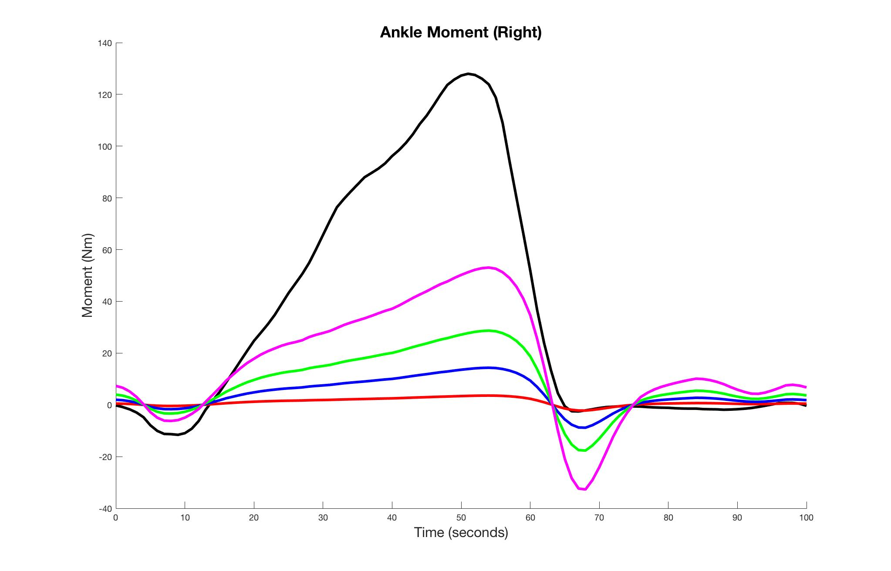

Hi, welcome to my portfolio.

My name is Eric Eckert. I am a third year student at the University of Washington in Seattle. I have interests in a wide variety of subjects. My main skills lie in computer programming, but my love for physics also drove me to take classes in mechanical engineering.

A current version of my resume is available [here](https://www.dropbox.com/s/epynqyth4lju63r/Eric_Eckert%20resume%20June%2014%2C%202016.pdf?dl=0).

-----

### Programming
You can find a summary of my github account [here](githubReport.html). It contains most of the projects I have done both in class and independantly. I've had experience programming in various contexts. [Here](https://github.com/ericsueckert) is the link to my actual Github profile.

```{r, echo=FALSE, message=FALSE}
library(jsonlite)
library(plotly)
library(dplyr)
source("scripts/github-api.R")

repo_df <- getUserInfo("ericsueckert")

# A bar plot showing number of repositories per language
summary_data <- repo_df %>% group_by(language) %>%
  summarise(
    total_repos = n()
  )
plot_ly(summary_data, x = language, y = total_repos,
        type = 'bar',
        color = total_repos
        ) %>%
  layout(xaxis = list(title = "Language"), yaxis = list(title = "Number of Repositories"))

```


---

### Research


I am very passionate about my research. I work in the [UW Steele Ability Lab](http://depts.washington.edu/uwsteele/) that researches orthotics. The project I work on specifically is optimizing ankle foot orthoses, or AFOs. I began my research in fall of 2015, and am still a part of the lab.


June 3 I attended my first conference, the [NorthWestern Biomechanics Symposium](http://www.nwbs.mech.ubc.ca/), which this year was held in Vancouver, BC in Canada. You can read the abstract [here](https://www.dropbox.com/home?preview=NWBS+2016+Abstract.pdf).


---

### Design


I have had some experience designing models with AutoCAD software. My best project is a simple model of a hidden blade inspired by the video game Assassin's Creed. 
You can view the design [here](https://grabcad.com/library/assassin-s-creed-hidden-blade-5).

