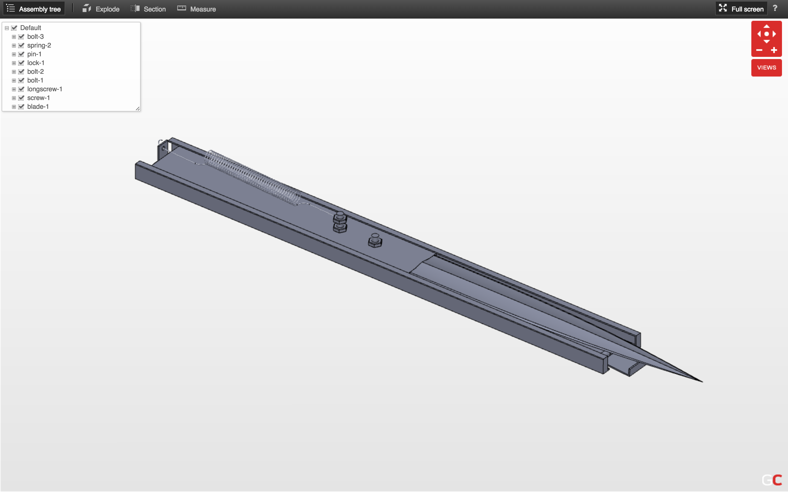

### CAD

In my second year of undergraduate study, I took a class in introductory AutoCad drawing. My final project is a simple model of a hidden blade inspired by the video game Assassin's Creed. The assembly contains 11 unique parts, and is fully defined. When the spring is removed, the appropriate constraints are in place so that parts may be moved. Also included is an exploded view drawing.

You can view the design [here](https://grabcad.com/library/assassin-s-creed-hidden-blade-5).
