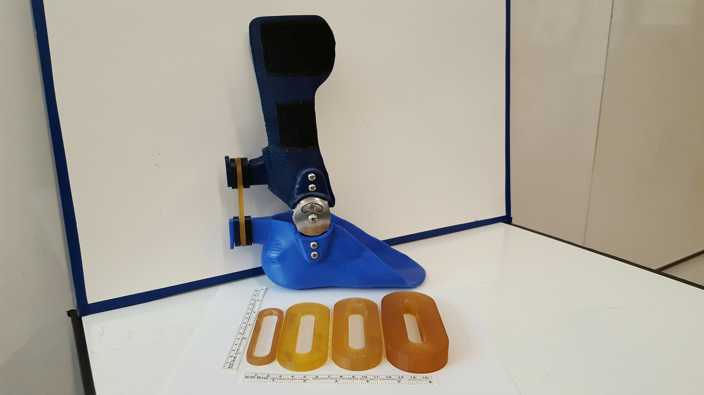
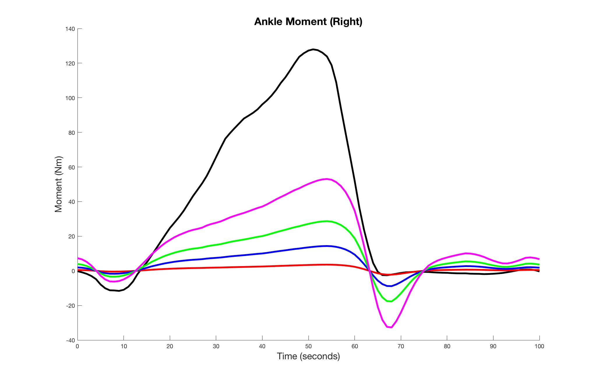

### Research

#### Ankle Foot Orthoses

I am very passionate about my research. I work in the [UW Steele Ability Lab](http://depts.washington.edu/uwsteele/) that researches orthotics. The project I work on specifically is optimizing ankle foot orthoses, or AFOs. I began my research in fall of 2015, and am still a part of the lab. This project means a lot to me, because around the time when I started, I began to doubt my ability to succeed in the traditional academic system, but this research was able to give me purpose in the hopes that one day I may change someone's life.

Ankle foot orthoses (or AFO for short) are commonly perscribed to individuals with impairment of the lower leg. AFOs aid in gait by inducing a moment on the ankle joint, reducing the need for biological ankle moment output by combining it with the mechanical ankle moment ouput of the AFO. For impaired individuals who are not able to produce full standard biological ankle moment output, the ankle moment of the AFO will supplement the biological ankle moment so that the total ankle moment will be on par with that of an unimpaired individual. AFOs have also been shown to reduce metabolic cost in unimpaired individuals.

The current standard of AFO consists of a single piece of plastic that the patient may wear. The fabrication process is both lengthy and expensive. Additionally if adjustments are desired, the AFO must be completely refabricated. Alternatively, a variable stiffness AFO would allow for adjustments of the mechanical moment of the AFO if needed. The purpose of our project is to manufacture effective variable stiffness AFOs using 3D printing technology.

Through classes and my time at the lab, I also learned how to program in MatLab. One example of my work is a script I wrote that takes kinematic data of the ankle joint, and draws a plot of ankle moment over a single gait cycle in addition to the mechanical moment induced by various polymer bands over gait cycle. You can view the repository for this script [here](https://github.com/ericsueckert/plot_ankle_moment).

June 3, 2016 I attended my first conference, the [NorthWestern Biomechanics Symposium](http://www.nwbs.mech.ubc.ca/), which this year was held in Vancouver, BC in Canada. You can read the abstract [here](https://www.dropbox.com/home?preview=NWBS+2016+Abstract.pdf).

#### Disability Stakeholder Research

This year in 2017 I am working with post-doctorate [Heather Feldner](https://depts.washington.edu/uwsteele/team_member/heather-feldner/) in analyzing stakeholder perceptions of human ability and disability. By holding interviews and focus groups with stakeholders, we can record their responses and conduct a qualitative analysis of the transcript. I will be approaching the issue from a more qualitative angle by writing an algorithm that will aggregate the diction in the transcript, which may provide more insight into stakeholder feedback.

If you are interested in learning more about the laboratory I work in, you can access the website [here](http://depts.washington.edu/uwsteele/). The project that I work on can be found as "Optimizing Orthoses" under the "Projects" tab. Here you can read a short summary of our project research, as well as view notable news regarding our project and team members. Official major publications by lab members may be found under the "Publications" tab.
